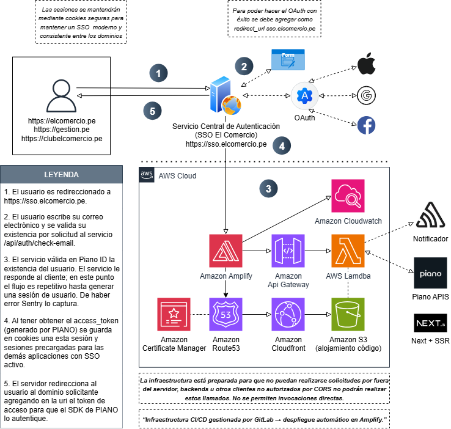

# 🧩 SSO El Comercio — Centralización de Sesiones

Este proyecto implementa un **Servicio Central de Autenticación (SSO)** para los dominios del grupo **El Comercio** (`elcomercio.pe`, `gestion.pe`, `clubelcomercio.pe`).  
Su propósito es **unificar las sesiones de usuario** y mantener un inicio de sesión seguro, moderno y consistente entre las distintas aplicaciones del grupo.

---

## 🚀 Funcionalidad principal

- 🔑 **Inicio de sesión único (SSO):**  
  Los usuarios se autentican una sola vez y pueden acceder al resto de dominios sin volver a iniciar sesión.

- 🧭 **Validación centralizada:**  
  Todas las solicitudes se canalizan por un **servicio proxy** y **API Gateway**, que verifican las credenciales y tokens mediante **AWS Lambda**.

- 🌐 **Compatibilidad con OAuth:**  
  El sistema permite autenticación con **Google, Apple y Facebook**, además del login tradicional por formulario.

- 🧱 **Gestión segura de sesiones:**  
  Las cookies se generan, asegurando integridad y persistencia de sesión entre dominios.

- 🪶 **Observabilidad y monitoreo:**  
  Los errores son capturados por **Sentry**, mientras que **Amazon CloudWatch** registra métricas y logs del entorno.

---

## ☁️ Arquitectura AWS

| Componente                     | Descripción                                             |
| ------------------------------ | ------------------------------------------------------- |
| **AWS Amplify**                | Despliegue del frontend (Next.js SSR)                   |
| **AWS Lambda**                 | Funciones de autenticación y validación                 |
| **Amazon API Gateway**         | Puerta de enlace entre frontend y backend               |
| **Amazon Route53**             | Resolución DNS y gestión de dominio `sso.elcomercio.pe` |
| **Amazon CloudFront**          | CDN y distribución de contenido estático                |
| **Amazon S3**                  | Almacenamiento de código y assets del sitio             |
| **Amazon Certificate Manager** | Certificados TLS para HTTPS                             |
| **Amazon CloudWatch**          | Monitoreo y alertas                                     |
| **Sentry**                     | Captura y trazabilidad de errores en producción         |

---

## 🔐 Flujo general de autenticación

1. El usuario es redirigido a **`https://sso.elcomercio.pe`**.
2. Se valida su existencia mediante el endpoint **`/api/auth/check-email`**.
3. **API Gateway** enruta la solicitud hacia las **Lambdas** encargadas de autenticar contra Piano ID.
4. Si la validación es correcta, se genera un **access_token** y se guardan **cookies seguras**.
5. El usuario es redirigido al dominio solicitante, ya autenticado con sesión activa.

---

## 🧰 Tecnologías principales

- [Next.js 15 (SSR)](https://nextjs.org/)
- [AWS Amplify](https://aws.amazon.com/amplify/)
- [AWS Lambda](https://aws.amazon.com/lambda/)
- [Amazon API Gateway](https://aws.amazon.com/api-gateway/)
- [TypeScript / Node.js](https://www.typescriptlang.org/)
- [Sentry](https://sentry.io/)
- [Amazon CloudWatch](https://aws.amazon.com/cloudwatch/)

---

## 🧩 CI/CD e Infraestructura

El despliegue se gestiona mediante **GitLab CI/CD**, que automatiza la construcción, pruebas y publicación del proyecto en **AWS Amplify**.  
Las variables de entorno y credenciales se administran desde GitLab para mayor seguridad y control.

## 🧭 Arquitectura del sistema

---

## 📄 Licencia

Proyecto interno de **El Comercio**.  
Uso restringido y confidencial.
